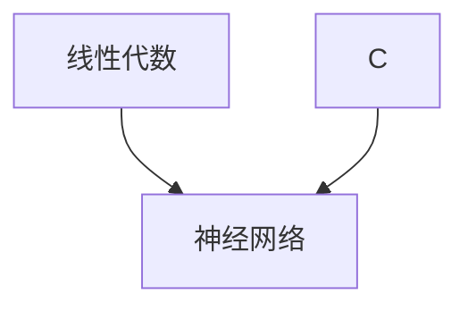

> 记录知识关系图谱和跨学科碰撞新奇发
# 知识图谱
> mermaid可能需要下载插件才能渲染


# 交叉理解

## 前向理解
> 定义：前向理解：A-->B，A为B的基础铺垫知识，通过深入学习A对B有更好的理解

### 01. Linear Algebra for Linear Layer of NN

从线性代数行列变换的角度看神经网络中的线性层

* 线性代数矩阵乘法，可以理解为右侧矩阵行的线性组合或左侧列的线性组合
* 线性层计算：$A = XW^T + B$，主要启发在于矩阵乘法$X W^T$的理解
* 其它涉及的知识
    * 深度学习并行性主要来源
    * 线性层的理解，并引发关于非线性引入方式的思考

以三维feat输入为例
```
对单样本，一维输出，对x的三个feat(三列)进行简单线性组合: 得到标量a
                |w11|
|x11 x12 x13| * |w12| = a
                |w13|

接着，我们可能希望捕捉不止一种线性组合结果，扩增方法是增加W维度
                |w11 w12|
|x11 x12 x13| * |w12 w22| = |a1 a2|
                |w13 w23|

再进一步,我们希望同时处理多个样本，扩增方法是增加x的维度
|x11 x12 x13|   |w11 w13|   |a11 a12|
|x21 x22 x23| * |w12 w23| = |a21 a22|
|x31 x32 x33|   |w13 w33|   |a31 a32|

最终就得到了线性层的通用表示形式XWT
```

**启发**
* $XW^T = A$中，每一个$a_{ij}$都代表了样本i的第j种线性组合
* 进一步，结果矩阵A中，每一个元素的计算过程都是独立的，可以实现并行，也就是将串行的三层循环矩阵乘转化为一层循环，循环完成对样本所有特征的线性组合
    * 并行性一部分来自于右侧w的第二个维度，代表了独立的不同线性组合
    * 并行性一部分来自于左侧x的第一个维度，代表了独立的不同样本
    * 那么原理是只要有足够多的进程池，W的第二个维度和batch_size都不会一个单独的Linear Layer的计算速度。
    * **这事实上也带来了一种新的看待矩阵乘法的角度（后继知识反哺前置知识）**
* 线性层就是线性代数研究的线线性组合，对原样本特征进行多种线性组合，得到新的特征组合，有点类似于特征工程里的特征重组（替代了手动特征工程过程）。
    * 那么就引入新的问题，NN的非线性如何引入，激活函数是如何实现非线性的？（TODO）
