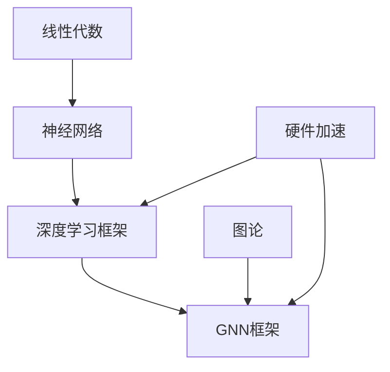

> 记录知识关系图谱和跨学科碰撞新启发
# 知识图谱
> mermaid可能需要下载插件才能渲染


# 交叉理解


## 前向理解
> 定义：前向理解：A-->B，A为B的基础铺垫知识，通过深入学习A对B有更好的理解

### 01. Linear Algebra for Linear Layer of NN

从线性代数行列变换的角度看神经网络中的线性层

* 线性代数矩阵乘法，可以理解为右侧矩阵行的线性组合或左侧列的线性组合
* 线性层计算：$A = XW^T + B$，主要启发在于矩阵乘法$X W^T$的理解
* 其它涉及的知识
    * 深度学习并行性主要来源
    * 线性层的理解，并引发关于非线性引入方式的思考

以三维feat输入为例
```
对单样本，一维输出，对x的三个feat(三列)进行简单线性组合: 得到标量a
                |w11|
|x11 x12 x13| * |w12| = a
                |w13|

接着，我们可能希望捕捉不止一种线性组合结果，扩增方法是增加W维度
                |w11 w12|
|x11 x12 x13| * |w12 w22| = |a1 a2|
                |w13 w23|

再进一步,我们希望同时处理多个样本，扩增方法是增加x的维度
|x11 x12 x13|   |w11 w13|   |a11 a12|
|x21 x22 x23| * |w12 w23| = |a21 a22|
|x31 x32 x33|   |w13 w33|   |a31 a32|

最终就得到了线性层的通用表示形式XWT
```

**启发**
* $XW^T = A$中，每一个$a_{ij}$都代表了样本i的第j种线性组合
* 进一步，结果矩阵A中，每一个元素的计算过程都是独立的，可以实现并行，也就是将串行的三层循环矩阵乘转化为一层循环，循环完成对样本所有特征的线性组合
    * 并行性一部分来自于右侧w的第二个维度，代表了独立的不同线性组合
    * 并行性一部分来自于左侧x的第一个维度，代表了独立的不同样本
    * 那么原理是只要有足够多的进程池，W的第二个维度和batch_size都不会一个单独的Linear Layer的计算速度。
    * **这事实上也带来了一种新的看待矩阵乘法的角度（后继知识反哺前置知识）**
* 线性层就是线性代数研究的线线性组合，对原样本特征进行多种线性组合，得到新的特征组合，有点类似于特征工程里的特征重组（替代了手动特征工程过程）。
    * 那么就引入新的问题，NN的非线性如何引入，激活函数是如何实现非线性的？（TODO）

### 02. Graph representation(Graph Theory) for GNN frameworks

> 图论中基础的图表示方法有邻接矩阵和邻接矩阵等，而PYG和DGL使用看起来完全图表示方法，这里深入探究PYG使用的(COO-Coordinate Format)和DGL使用的CSR(Compressed Sparse Row)/CSC(Compressed Sparse Column)格式。
>
> **随后在理解框架图表示方法的基础上深入探究GNN框架针对图做硬件优化的部分**

#### 三种表示方法的示例说明

> COO，CSR，CSC都是邻接矩阵的一种表示方式，可以直接对照着邻接矩阵来理解。
```
对于4x4的稀疏矩阵(带权重),假设邻接矩阵为
    |0 3 0 0|
A = |2 0 0 5|
    |0 0 1 0|
    |0 4 0 2|
```
**COO**

COO是最直观的稀疏矩阵表示方法，直接存储非零元素的坐标(行、列)和值。
e.g.
```
其COO格式表示为
row = [0, 1, 1, 2, 3, 3]
col = [1, 0 ,3, 2, 1, 3]
data= [3, 2, 5, 1, 4, 2]    # 三个数组长度相同，索引对应
```

**CSR/CSC**

CSR是一种行压缩格式，相应的CSC是一种列压缩格式，通过三个数组表示稀疏矩阵。
e.g.
```
CSR:
data  =   [3, 2, 5, 1 ,4, 2]  # 非零元素（行优先）
indices = [1, 0, 3, 2, 1, 3]  # 列索引  与非零元素一一对应
indptr = [0, 1, 3, 4, 6]  # 行指针：第i行的元素范围是 indptr[i]到indptr[i+1]-1
# indptr长度为n+1，相当于划分数据到n个行里。第i个数值代表第i行第一个非零元素的索引

CSC:
data    =  [2, 3, 4, 1, 5, 2]
indices =  [1, 0, 3, 2, 1, 3]   # 列索引，与非零元素一一对应
indptr = [0, 1, 3, 4, 6]
```
> 所以三种方法本质都是基础的邻接矩阵的变种，适合于稀疏矩阵（实际图大多是都是稀疏矩阵）

三种方式对比(节点数为n,边数为m)
格式|COO|CSR|CSC
--|--|--|--
存储方式|坐标三元组(i,j,v)|二元组(v, j)+行首索引|二元组(v, i)+列首索引
优势操作|构建简单，适合动态插入和任意顺序访问|高效行访问，适合逐行便利运算(矩阵-向量乘法)|高效列访问，适合按列进行的运算(矩阵转置，列聚合)
劣势操作|不适合直接进行矩阵运算(需转为CSR/CSC)。空间效率低|列访问效率低，插入、删除元素复杂|行访问效率低...
适用场景|快速构建稀疏矩阵|消息传递、图遍历(按节点)|特殊运算(如线性代数求解)
空间复杂度|O(3m)|O(2m+n+1)|O(2m+n+1)

> 总结一下，对于(稀疏)邻接矩阵的表示，直接使用三元组表示边是最直接也最简单的想法（也就是COO方法，PYG使用这种方法）。进一步，可以**按行遍历或列遍历的顺序提前将边排好序**，并压缩行/列索引到行/列数，节省了空间的同时提高了行/列访问的效率(这就是CSR/CSC,DGL使用这种方法)。当然这样做带来的损失就是边的增删都需要再重新遍历并排序以后的存储数据，对于动态图来说这种存储方式的增删成本会较高。

#### PYG和DGL如何加速
> 上面已经对三种存储方式有了深入的理解，接下来看一下GNN框架是如何针对边上消息传递的过程进行加速处理的。

**PYG加速机制**

PYG加速核心主要依赖于COO格式的灵活性和Pytorch的向量化运算

* 批处理优化:伪图(Pseudo-Graph)构建。将多个(小)图所有节点和边拼接，避免了显示循环处理每个图
```python
from thrch_geometric.data import Batch

# 假设date_list包含多个Data对象(小图)
batch = Batch.from_data_list
```
* 将消息传递转化为`稀疏矩阵-张量乘法`，`Pytorch`的`torch.spmm`针对COO格式做了优化，避免显示遍历每条边
```python
# 消息传递核心操作:X' = D^(-1/2)·A·D^(-1/2) · X
adj_t = normalize(edge_index)  # 归一化邻接矩阵
out = torch.spmm(adj_t, x)  #稀疏矩阵乘法
```
* 内存优化：
    * In-place操作，在不影响结果的情况下直接修改输入张量，减少内存分配
    * 缓存机制，对于静态图，缓存预计算结果(如：上面代码的归一化)，避免重复计算

> TODO,torch.spmm优化细节

**DGL加速机制**

DGL加速核心主要依赖于CSR/CSC格式的高效矩阵运算和图计算专用优化

* 块级并行：DGL将图划分为多个块，支持并行处理。原理是利用CSR格式行压缩特性，并行处理多个节点的消息
> 解决大规模图的 “拆分计算” 问题，通过分块计算 + 跨块通信实现并行，核心是 “空间拆分 + 数据依赖管理”。

* 算子融合：DGL将多个连续的图操作合并为一个核函数，减少GPU内核启动和数据传输开销。
```python
# 自定义消息函数和聚合函数, 详细用法见03frameworks-dgl学习笔记部分
def message_func(edges):
    return {'msg': edges.src['h']}  # 从源节点传递特征
def reduce_func(nodes):
    return {'h': torch.mean(nodes.mailbox['msg'], dim=1)}  # 聚合邻居消息
# 并行应用消息传递
g.update_all(message_func, reduce_func) # 包括消息传递函数和规约函数
# 更新函数可以直接写，前两个函数用到了DGL内置方法，可以针对图操作进行加速
# 融合消息函数和聚合函数为单一操作

g.apply_edges(lambda edges: {'e': edges.src['h'] * edges.dst['h']}) # 边表示更新
```
> 解决单设备内的 “计算效率” 问题。GNN 的消息传递包含多步连续操作（如 “消息生成→聚合→更新”），每步操作会产生中间结果（如临时消息、聚合缓存），频繁读写这些中间数据会导致内存带宽瓶颈（尤其在 GPU 上，内存访问比计算慢得多）。算子融合的本质是将多步独立算子合并为一个 “融合算子”，减少中间数据的存储与读写，核心是 “时间 / 计算流优化”。

* 内存预取：DGL提前将特征加载到GPU缓存中，减少内存访问延迟
```python
g.prefetch_feature('h')
```
> 就是异步内存拷贝，在计算上一批次数据是提前准备下一批次的数据。
* 图分区与分布式计算：对于超大规模图，DGL支持将图划分为多个子图，分布在多台机器或GPU上。
* 异构计算优化：CPU负责图结构操作(如遍历边、分区),GPU负责张量计算(如特征聚合，矩阵乘法)

**对比**
格式选择原因

框架|图表示格式|核心考量
--|--|--
PYG|COO|灵活性优先，适合快速进行原型开发，与pytorch深度继承,利用torch.sparseAPI
DGL|CSR/CSC|计算效率优先：优化矩阵乘法和消息传递；支持大规模图：CSR适合分块处理

加速策略对比

策略|PYG|DGL
--|--|--
批处理方式| 合并为伪图(Batch)| 原生支持图批量
消息传递核心| 稀疏矩阵乘法torch.spmm|块级并行+算子融合
内存优化| In-place操作 | 预取+缓存复用
分布式支持| 手动实现|内置图分区和分布式训练

性能对比
图规模|操作|PYG时间|DGL时间
--|--|--|--
小图(1k节点)|消息传递|12ms|8ms
中等图(100k节点)|消息传递|250ms|120ms
大图(10M节点)|全图训练|需分块处理|4.2s

**总结**
> 从优化的角度看，GNN主要是需要以边为循环进行消息传递(用于更新节点或边表示),框架主要优化点也在这里。PYG利用了pytorch原生的稀疏矩阵乘法进行优化，而DGL做了更有针对性的专门优化, 包括对图操作的并行优化和大图分布式支持。

> DGL优化效果显著，PYG适合快速原型开发，且在小图上性能差的不会太多。对于工业级应用，追求极致的效率，或必须处理大图时，DGL更合适。另一个考量角度是图的拓扑连接变化频率，PYG的COO可以高效处理图结构变化，而DGL的CSR处理图结构变化效率较低。